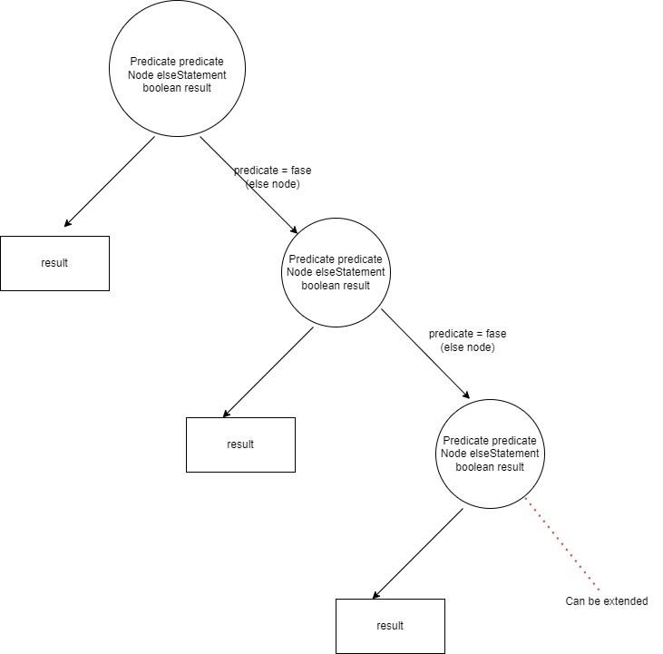

# Predicate Parser

Java Springboot Application that allow to store simple if-else predicate and allow to do evaluation with that by providing different inputs

### use case
Consider a typical If-Statement in a programming language. For example:

```
If (a == “abc” && b > 4) 
	then true 
else if (b < 10) 
	then true
else false
```

Above should be represented in JSON format as in the following

```json
{
	"properties": {
		"1": {
			"type": "String",
			"name": "a"
		},
		"2": {
			"type": "Integer",
			"name": "b"
		}
	},
	"logic": {
		"if": {
			"operator" : "AND",
			"operands" : [
				{
					"inputId": 1,
					"operator": "EQUAL",
					"value": "abc"
				},
				{
					"inputId": 2,
					"operator": "EQUAL",
					"value": 4
				}
			]
		},
		"result": true,
		"else": {
			"if": {
				"operator" : "AND",
				"operands" :  [
					{
						"inputId": 2,
						"operator": "LESS_THAN",
						"value": 10
					}
				]
			},
			"result":  true,
			"else": {
				"result": false
			}
		}
	}
}
```

This Rest API contains 2 endpoints;
- Rest Api contains endpoint for uploading predicate and store in json file inside service. This was implemented as a simple example. So that decided to store in a file. To make this scalable, consistent and distributed solution that runs in concurrent environment needs to consider integrating proper data source.

- Rest Api contains endpoint to provide inputs and get the evaluated result against pre-stored predicate


### Notes
- Current implementation only accept predicate in json format. Parser factory implementation is there for future extension.
- Current implementation covers only 2 inputs (a,b). "properties" attribute is introduced to support more attributes.
- Implementation of Request Parameter Validation was not completed. 
- predicate json string need to be validated to  check it has the correct schema 

## Data structure for the JSON representation

Data structure is build considering the Binary Tree Structure




# Local environment setup [without Docker]
- Pre Requisites:

  ``1.install java 11``
- Run following command to build and start the application

  ``./gradlew build``

  ``./gradlew bootrun``
- Access the Swagger UI by ``http://localhost:8080/swagger-ui/index.html#``

# Local environment setup [Docker]
- Pre Requisites:

  ```
  1. Install java 11
  2. Install docker
  ```

- Run following command to build and start the application

  ``docker build --tag=ifelsepredicateparser:latest .``

  ``docker run -p8080:8080 ifelsepredicateparser:latest``
- Access the Swagger UI by ``http://localhost:8080/swagger-ui/index.html#``

# CI/CD Integration

- Github workflow is configured to deploy the service to AWS EC2 (code : `.github/workflows`)
- Terraform is used for provisioning resources (code: `infrastructure/terraform`)

# API Specification

There are 2 APIs are included
  1. upload predicate and store in json file
  2. provide argument and get the result 
 
Swagger 3 is integrated. For API documentation 
     - URL : http://localhost:8080/swagger-ui/index.html
